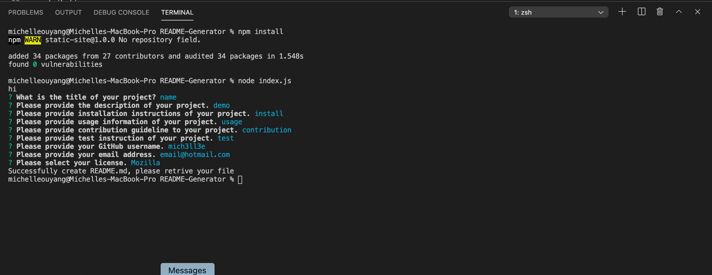

# README-Generator

## Description
This is a README Generator Application, it allows developers to easily create a detail README file for their project. 

Formatting of this generator is based on the attached file (Assets/AGOODREADME.md)

This repository contains the generator: (index.js)
directory;
package.json files;
(SampleREADNE.md)

#User Story
As a developer, I want to easily develop a good README file for my project, I want to make sure I don't miss any content. 

## Screenshot

## Instruction Video 

https://drive.google.com/file/d/1yIXQajGPj417ytx6iVUII-dtECBImr27/view

## Credits
Michelle Ouyang
GitHub: mich3ll3e
Email: michelle.ouyang@outlook.com
